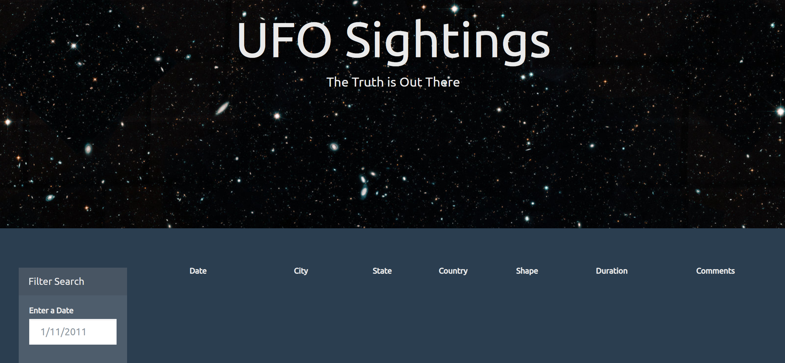
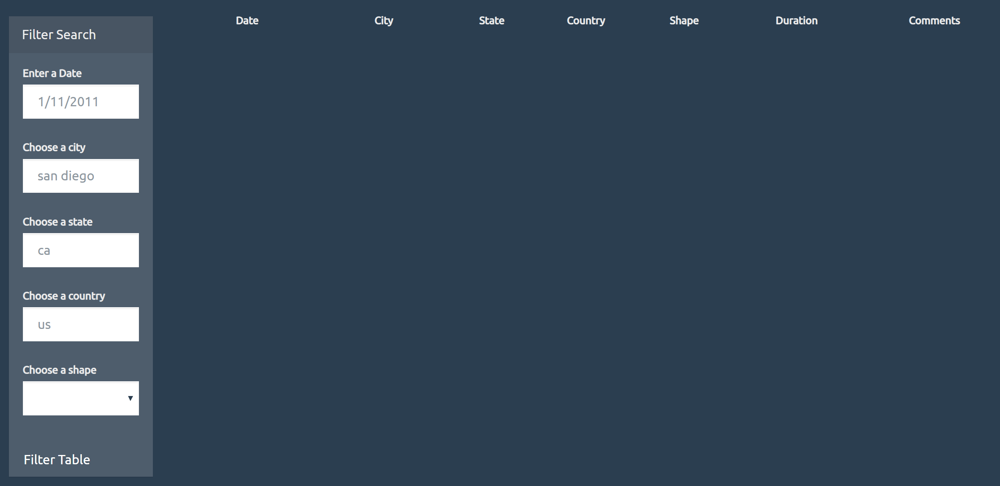
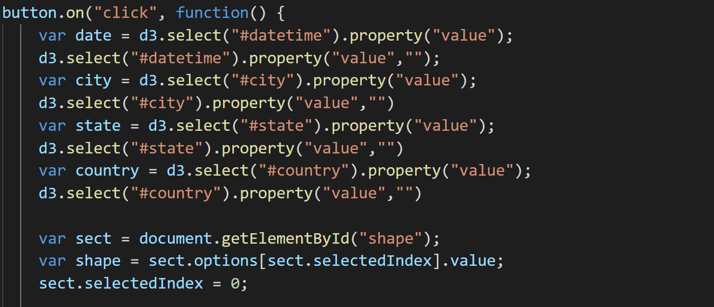
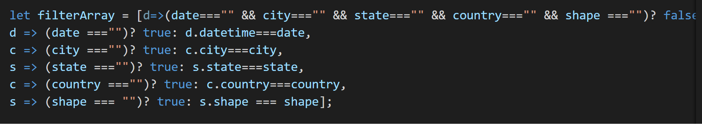

# Javascript Homework
1. In this homework, I created an **index.html** to show the filtered data based on the condition that inputed by the user.
### Level 1:
2. In level 1, only one condition put in is date to filter. 

 
 
3. The user just input the date to filter the data from **data.js**.

### Level 2:
4. In level 2, we will have more condition to filter the date, we use both the input and dropdown menu to choose the items.
5. Generally, the data will not come up if no condition filled in, it means that at least one condition have to put in to filter the data.

  
  
6. In the **app.js**, we read condition inputs from html and dropdown menu into, every time the user click on **FilterTable** button, it gets the conditions and clear the input spaces.

  
  
7. We set up the filter array as follow: the first condition is that not all input field is empty, at least a field has to be filled; we can filter for any input and others empty.

  
  
  
